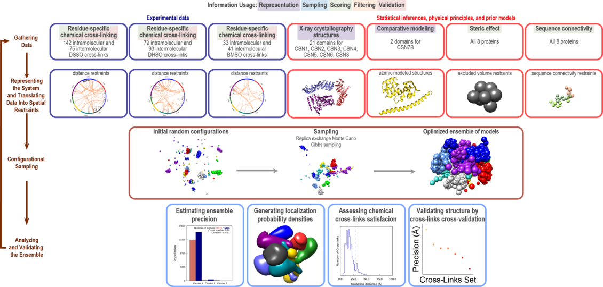

# Integrative Structure Determination of the Human Cop9 Signalosome complex (CSN)

## Summary
The COP9 signalosome (CSN) is an evolutionarily conserved eight-subunit (CSN1–8) protein complex that controls protein ubiquitination by deneddylating Cullin-RING E3 ligases (CRLs). The activation and function of CSN hinges on its structural dynamics, which has been challenging to decipher by conventional tools. Here, we determine the interaction and structural dynamics of CSN with the recently discovered ninth subunit, CSN9, in solution. Our results determined the localization of CSN9 binding sites and revealed CSN9-dependent structural changes of CSN. Together with biochemical analysis, we propose a structural model in which CSN9 binding triggers CSN to adopt a configuration that facilitates CSN–CRL interactions, thereby augmenting CSN deneddylase activity. 
These scripts demonstrate the use of [IMP](http://salilab.org/imp) in the modeling of the human Cop9 Signalosome (CSN) complex using multi-crosslinking datasets. 
The scripts work with the [IMP](http://salilab.org/imp) (Release 2.8.0 and newer).

## List of files and directories:

- `data`   	 contains all relevant information: experimental data, statistical analyses, and prior information.
- `modeling_scripts`	 contains all the modeling script variants for each of the determined structures to reproduce the ensemble of solutions. 
- `results`	 contains all the relevent results discussed in the published paper.

## Integrative modeling approach summary for this project

## Information

_Author(s)_: Ilan E. Chemmama

_License_: [CC BY-SA 4.0](https://creativecommons.org/licenses/by-sa/4.0/)
This work is licensed under the Creative Commons Attribution-ShareAlike 4.0
International License.

_Last known good IMP version_:  

_Publications_:
Structural dynamics of the human COP9 signalosome revealed by cross-linking mass spectrometry and integrative modeling.  
Craig Gutierrez*, Ilan E. Chemmama*, Haibin Mao, Clinton Yu, Ignacia Echeverria, Sarah A. Block, Scott D. Rychnovsky, Ning Zheng, Andrej Sali, Lan Huang  
Proceedings of the National Academy of Sciences Feb 2020, 117 (8) 4088-4098; DOI: [10.1073/pnas.1915542117](http://dx.doi.org/10.1073/pnas.1915542117).  
 
