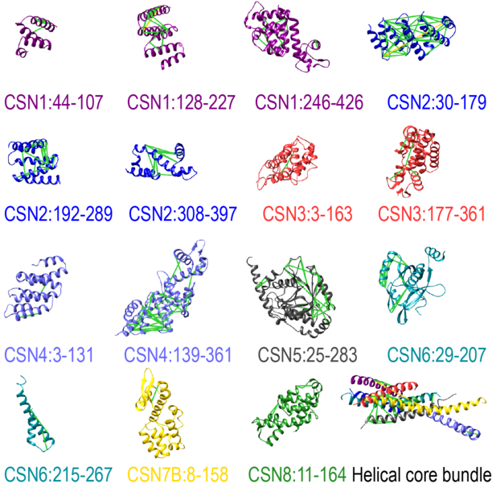
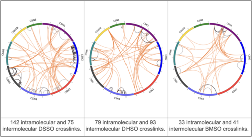
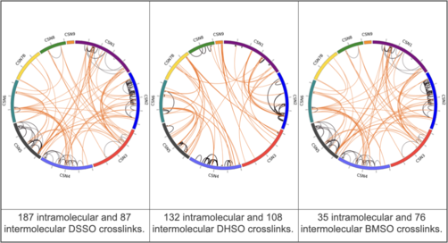

# Cop9_Signalosome Complex

Master data directory; used by all modeling scripts to generate the solutions of the CSN complex.

## List of files and directories:

`data` contains all relevant data
## Sequence and structures files
- `CSN.fasta` contains all the sequences of the CSN complex (CSN1-CSN9).
- `CSN.pdb` is the crystal structure of the canonical CSN complex (PDB code 4D10; [article](10.1038/nature13566))
- `CSN1.pdb` is the complete model of the CSN1 subunit, obtained using MODELLER (see [CSN1](./CSN1))
- `CSN7B.pdb` is the structure of the CSN7B subunit isoform, modeled against subunit CSN7A isoform using MODELLER (see [CSN7B](./CSN7B)).

### Representation Summary

## Cross-linking datasets for the canonical CSN complex
- `BMS.Inter.csv` and `BMS.Intra.csv`: BMSO - 41 intermolecular and 33 intramolecular cross-links for the canonical CSN complex
- `DHS.Inter.csv` and `DHS.Intra.csv`: DHSO - 93 intermolecular and 79 intramolecular cross-links for the canonical CSN complex
- `DSS.Inter.csv` and `DSS.Intra.csv`: DSSO - 75 intermolecular and 142 intramolecular cross-links for the canonical CSN complex

### Summary of the canonical CSN cross-linking dataset

## Cross-linking datasets for the noncanonical CSN complex (CSN1-8 + CSN9)
- `BMS.Inter.P.csv` and `BMS.Intra.P.csv`: BMSO - 76 intermolecular and 35 intramolecular cross-links for the CSN complex with CSN9
- `DHSO.Inter.P.csv` and `DHSO.Intra.P.csv`: DHSO - 108 intermolecular and 132 intramolecular cross-links for the CSN complex with CSN9
- `DSS.Inter.P.csv` and `DSS.Intra.P.csv`: DSSO - 87 intermolecular and 187 intramolecular cross-links for the CSN complex with CSN9

### Summary of the noncanonical CSN cross-linking dataset

## Topology files used for modeling: defining rigid bodies and flexible beads regions.
- `topology_free.txt` and `topology_free_plus.txt` are the topology files for the canonical and noncanonical CSN complex, respectively.

## Information

_Author(s)_: Ilan E. Chemmama

_License_: [LGPL](http://www.gnu.org/licenses/old-licenses/lgpl-2.1.html).
This library is free software; you can redistribute it and/or
modify it under the terms of the GNU Lesser General Public
License as published by the Free Software Foundation; either
version 2 of the License, or (at your option) any later version.

_Publications_:
