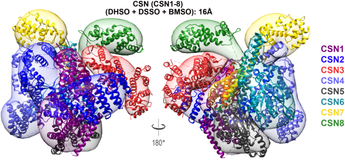
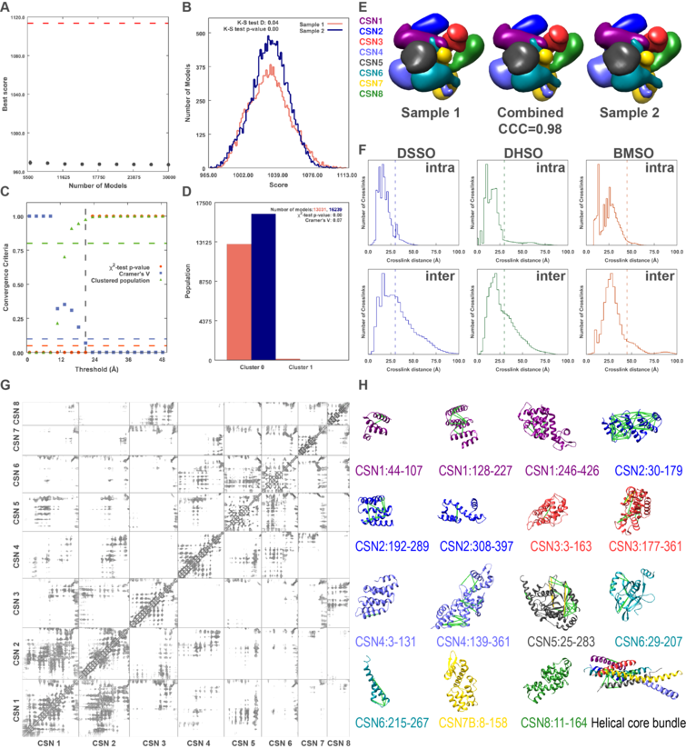
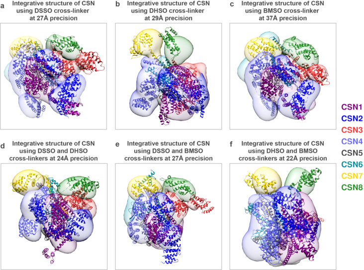

# Integrative Structure of the human canonical Cop9 Signalosome Complex 
Directory for visualizing the human canonical CSN complex, obtained by integrative modeling.
 
## Highlights of results.

## List of files and directories:

- `IntegrativeStructure.CSN` contains the subdirectories for the canonical structure of CSN complex (centroid and localization probability densities):
    * [Canonical CSN (DSSO+DHSO+BMSO)](./IntegrativeStructure.CSN/Structure_DSSO_DHSO_BMSO/) at a precision of 16Å.
    * [Subsample CSN (DHSO+BMSO)](./IntegrativeStructure.CSN/Structure_DHSO_BMSO/) at a precision of 22Å.
    * [Subsample CSN (DSSO+DHSO)](./IntegrativeStructure.CSN/Structure_DSSO_DHSO/) at a precision of 24Å.
    * [Subsample CSN (DSSO+BMSO)](./IntegrativeStructure.CSN/Structure_DSSO_BMSO/) at a precision of 27Å.
    * [Subsample CSN (DSSO)](./IntegrativeStructure.CSN/Structure_DSSO/) at a precision of 27Å.
    * [Subsample CSN (DHSO)](./IntegrativeStructure.CSN/Structure_DHSO/) at a precision of 29Å.
    * [Subsample CSN (BMSO)](./IntegrativeStructure.CSN/Structure_BMSO/) at a precision of 37Å.
    * [Sampling Precision](./sampling_precision_canonical) contains the results of the exhaustiveness tests for the [canonical CSN complex](./sampling_precision_canonical/DSSO_DHSO_BMSO) and for each of the [subsamples](./sampling_precision_canonical/sampling_precision_subsamples.tar). The plotting scripts are located in [sampling_precision_plotting_scripts](./sampling_precision_canonical/sampling_precision_plotting_scripts/). 

## Highlights of the validation

## Highlights of the cross-validation

## Notes

- To display the ensembles, one can modify the provided UCSF Chimera python script ***chimera_display_ensemble.py*** by changing the *suffix* variable in the script. 

_Author(s)_: Ilan E. Chemmama

_License_: [LGPL](http://www.gnu.org/licenses/old-licenses/lgpl-2.1.html).
This library is free software; you can redistribute it and/or
modify it under the terms of the GNU Lesser General Public
License as published by the Free Software Foundation; either
version 2 of the License, or (at your option) any later version.
