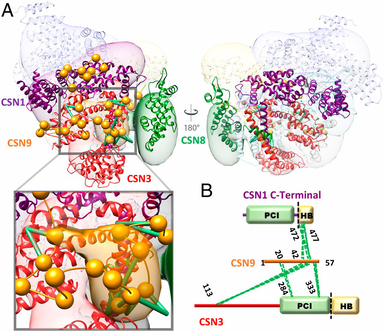
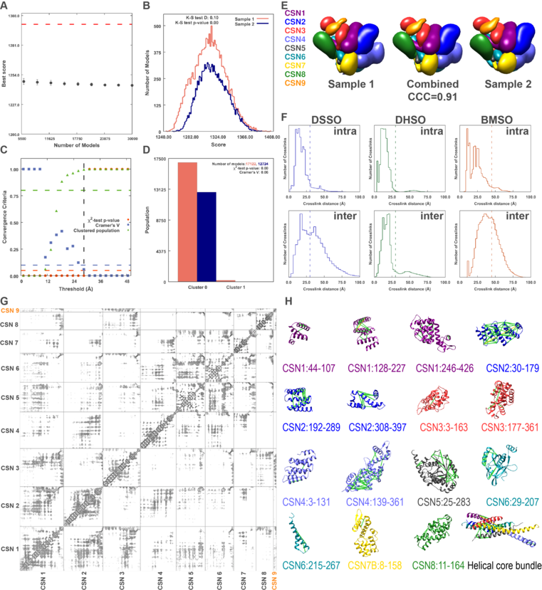

# Integrative Structure of the human non-canonical Cop9 Signalosome Complex 
Directory for visualizing the human non-canonical CSN complex, obtained by integrative modeling.
 
## Highlights of results.

## List of files and directories:

- `IntegrativeStructure.CSNn` contains the subdirectories for the non-canonical structure of CSN complex (centroid and localization probability densities):
    * [Noncanonical CSN (DSSO+DHSO+BMSO)](./IntegrativeStructure.CSNn/Structure_DSSO_DHSO_BMSO/) at a precision of 22Å.
    * [Sampling Precision](./sampling_precision_noncanonical) contains the results of the exhaustiveness tests for the [noncanonical CSN complex](./sampling_precision_canonical/DSSO_DHSO_BMSO).

## Highlights of the validation

## Notes

- To display the ensembles, one can modify the provided UCSF Chimera python script ***chimera_display_ensemble.py*** by changing the *suffix* variable in the script. 

_Author(s)_: Ilan E. Chemmama

_License_: [LGPL](http://www.gnu.org/licenses/old-licenses/lgpl-2.1.html).
This library is free software; you can redistribute it and/or
modify it under the terms of the GNU Lesser General Public
License as published by the Free Software Foundation; either
version 2 of the License, or (at your option) any later version.
